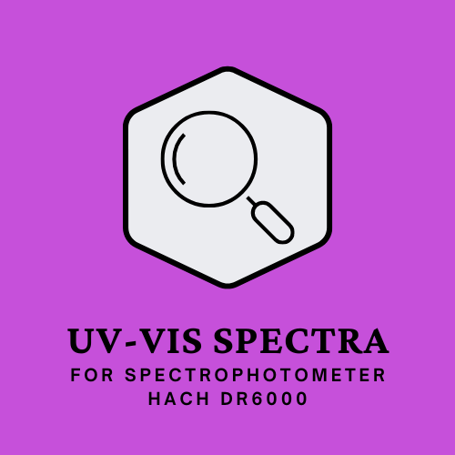

<a name="readme-top"></a>

[![Contributors][contributors-shield]][contributors-url]
[![LinkedIn][LinkedIn]][LinkedIn-url]


<!-- PROJECT LOGO -->
<br />
<div align="center">
  <a href="https://github.com/agatabiesiekierska/UV-VIS-spectra">
    
  </a>

<h3 align="center">UV-VIS Spectra</h3>

  <p align="center">
    This project is dedicated to users of the HACH DR6000 spectrophotometer. It allows to create multiple spectra and linear regression for specific wavelength based on data downloaded from the device.
    <br />
    <a href="https://github.com/agatabiesiekierska/UV-VIS-spectra"><strong>Explore the docs »</strong></a>
    <br />
    <br />
    ·
    <a href="https://github.com/agatabiesiekierska/UV-VIS-spectra/issues">Report Bug</a>
    ·
    <a href="https://github.com/agatabiesiekierska/UV-VIS-spectra">Request Feature</a>
  </p>
</div>


<!-- TABLE OF CONTENTS -->
<details>
  <summary>Table of Contents</summary>
  <ol>
    <li>
      <a href="#about-the-project">About The Project</a>
      <ul>
        <li><a href="#built-with">Built With</a></li>
      </ul>
    </li>
    <li>
      <a href="#getting-started">Getting Started</a>
      <ul>
        <li><a href="#prerequisites">Prerequisites</a></li>
        <li><a href="#installation">Installation and Starting the program</a></li>
      </ul>
    </li>
    <li><a href="#usage">Usage</a></li>
    <li><a href="#contact">Contact</a></li>
  </ol>
</details>


<!-- ABOUT THE PROJECT -->
# About The Project

[![Main_Window][Main_Window]](https://github.com/agatabiesiekierska/UV-VIS-spectra)

<H4>The illustration depicts the program interface, where users have the capability to upload a data folder. Upon filling in the necessary fields, they can produce a spectrum graph covering the entire measurement range or generate a graph illustrating absorbance versus concentration at a designated wavelength. Furthermore, the program provides the option to consolidate data from the device into a singular Excel file.</H4>

<p align="right"><a href="#readme-top">back to top</a></p>


## Built With

[![Python][Python]][Python-url]
[![Tkinter][Tkinter]][Tkinter-url]
[![Matplotlib][Matplotlib]][Matplotlib-url]
[![Pandas][Pandas]][Pandas-url]
[![Scipy][Scipy]][Scipy-url]


<p align="right"><a href="#readme-top">back to top</a></p>


<!-- GETTING STARTED -->
## Getting Started

### Download program
If you want to use this program just download file called <b>"UV-VIS_spectra.exe"</b>. It contains all required packages in correct versions so after you launch the file everything should work.

### Manual Installation
If for some reason you don't want to use .exe version, here's the instructions what should you do:

* To use properly this program you need Python on your computer in version 3.11. You can download it after you hit this banner:  
[![Python][Python]][Python-url]

* Clone the repo (or just download folder with all files)
  ```sh
   git clone https://github.com/agatabiesiekierska/UV-VIS-spectra.git
  ```

* In file <b>"requirements.txt"</b> I put all the packages I used in this project (with versions). You can use it to install all packages using command below (remember to move to directory with the file):
  
  ```sh
  pip install -r requirements.txt
  ```

* All you need is placed in folder <b>"Source_code"</b>. File <b>GUI.py</b> is responsible for program window while <b>main.py</b> coresponds to functions generating plots, merging files etc.

* To start program just type:
   ```sh
   python GUI.py
   ```


<p align="right"><a href="#readme-top">back to top</a></p>


<!-- USAGE EXAMPLES -->
## Functions of program

This paragraph will explain how to use this program and shows all functions. Notice that some fields are marked by star (*) sign. This means that you have to fill it, otherwise an error will appear.

<H3> Import Data </H3>

1. To import your data just choose the directory of your folder with files from spectrophotometer. Model DR6000 use the files with .xml format and only this type of files are acceptable. Also, files have to be named in correct order - this means samples with the lowest concentration have to be named with the lowest number. Only then the outpun will be correct. For example:  <br/>

```
ScanData_DR6000_2200156_1.xml - lowest concentration  (ex. 0 [ppm])
ScanData_DR6000_2200156_2.xml
ScanData_DR6000_2200156_3.xml
ScanData_DR6000_2200156_4.xml - highest concentration  (ex. 100 [ppm])
```
2. After you hit the <b>Import folder</b> button choose directory with your files.
3. Path to files will appear in entry field <br/>

[![Import_Folder][Import_Folder]]()

<H3> Make UV-Vis spectra </H3>

This part of program allows user to generate UV-VIS spectra from data in given directory. User can submit concentrations of the samples in [ppm] after comma (,) - otherwise the sample label will be the file name from the imported folder. Same for option <b>Merge All Files</b>.

<p align="center">
    
</p>

<H3><b> Merge All Files </b></H3>

This function imports all files from given folder and returns an excel file with all merged data. After clicking <b>Merge All Files</b> button, the folder with merged files is displayed. All generated files have time in their name for recognition. User can copy this file into another directory and work on it. <br/><br/>

<p align="center">
    
</p>

As you can see in the picturee below, given concentriations, are automatically label for specific column with absorbance measurements <br/><br/>

<p align="center">
    
</p>

<H3><b> Draw Spectra </b></H3>

This function is responsible for generating, saving and displaying the graph. The only required value is path to folder with data. However, if user wants to change figure parameters, such as length of the x and y axes or add title, he is able to do so by clicking <b>Change Draw Spectra Options </b> in Options in menu bar. The default parameters are:

* For x-axis: from 200 nm to 700 nm
* For y-axis: from 0 to 3

The figure below shows example correct input:
<p align="center">
    
</p>

If everythig worked successfully, after pressing <b> Draw Spectra </b>button the generated image will appear on the right side of the window: <br/><br/>
[![Spectra][Spectra]]()

But if something went wrong, the programm will display a messagebox with error. <br/><br/>

<p align="center">
    
</p>

5. The figure with UV-Vis spectra will appear in <b>graph</b> folder. To access that folder click <b>Open Image Folder</b> button. Folder with generated graphs will display:

<p align="center">
    
</p>

Files named uv-vis-spectra... are figures generated by option Draw Spectra.

<H3><b> Draw Curve for specific wavelength </b></H3>
This part of program is responsible for generating, saving and displaying the graph illustrating absorbance versus concentration at a given wavelength. 

1. When you provide directory of the folder with data, you have to pass concentrations of the samples in increasing order, after comma (,): <br/><br/>

```
Example input: 0,10,20,30,40,50 
```
2. After that pass wavelength, <b> remember that this value has to be in your measurments, otherwise the error will appear! </b> <br/>

3. If you think that one of the samples should be rejected, enter its concentration in the rejected samples field. If there are more, enter them after a comma (,)

4. If you want to show rejected samples in the plot, check the box "<i>Show rejected samples in the plot</i>"

5. If you want to make linear regression (for example in Calibration Curve), check the box "<i>Make linear regression</i>"

6. If you want to change color of the plot, add title and change plot markers, click <b>Change Draw Linear Plot Options</b> in Options in menu bar. After that the dialog will appear:

<p align="center">
    
    
</p>
The default parameters are:

* For color of the plot: blue
* For marker: circle
* For color of the rejected samples: red

In the color field, you can enter the color value in English in lowercase letters (eg. orange, red, blue, yellow, green) or in the Hex format (eg. #FF00FF).

7. If everythig worked successfully, after pressing <b> Draw Linear Plot </b>button the generated image will appear on the right side of the window: <br/><br/>

<p align="center">
    
</p>

8. If you want to export figure click <b> Open Image Directory </b>button and find the plot.

<p align="right"><a href="#readme-top">back to top</a></p>

<H3>Menu Bar</H3>
There are 3 tabs in menu bar:

* Data - where you can import your directory, open folder with merged files and exit program
* Options - where you can change options for the plots
* Help - where you can find information about the program


<!-- CONTRIBUTING -->
## Contributing

If you have a suggestion that would make this program better, please fork the repo and create a pull request. 

1. Fork the Project
2. Create your Feature Branch (`git checkout -b feature/NewFeature`)
3. Commit your Changes (`git commit -m 'Add some NewFeature'`)
4. Push to the Branch (`git push origin feature/NewFeature`)
5. Open a Pull Request

<p align="right"><a href="#readme-top">back to top</a></p>


<!-- CONTACT -->
## Contact

 [![LinkedIn][LinkedIn]][LinkedIn-url]  

Project Link: [https://github.com/agatabiesiekierska/UV-VIS-spectra](https://github.com/agatabiesiekierska/UV-VIS-spectra)

Gmail: ag.biesiekierska@gmail.com

<p align="right"><a href="#readme-top">back to top</a></p>


<!-- MARKDOWN LINKS & IMAGES -->
<!-- https://www.markdownguide.org/basic-syntax/#reference-style-links -->

[contributors-shield]: https://img.shields.io/github/contributors/agatabiesiekierska/UV-VIS-spectra.svg?style=for-the-badge
[contributors-url]: https://github.com/agatabiesiekierska/UV-VIS-spectra/graphs/contributors

[issues-shield]: https://img.shields.io/github/issues/agatabiesiekierska/UV-VIS-spectra.svg?style=for-the-badge
[issues-url]: https://github.com/agatabiesiekierska/UV-VIS-spectra/issues

[LinkedIn]: https://img.shields.io/badge/LinkedIn-0A66C2?style=for-the-badge&logo=linkedin&logoColor=white
[LinkedIn-url]: https://www.linkedin.com/in/agata-biesiekierska-6293a4271

[Main_Window]: images_for_readme\main_window.png
[IMGfolder]: images_for_readme\folder-with-images.png
[MergedFolder]: images_for_readme\merged-data-folder.png
[MergedFile]: images_for_readme\merged-file.png
[Spectra]: images_for_readme\uv-vis-spectra.png
[LinearPlot]: images_for_readme\linear_plot.png
[Import_folder]: images_for_readme\Import_folder.png
[draw_spectra_options]: images_for_readme\draw_spectra_options.png

[Python]: https://img.shields.io/badge/python_3.11-3670A0?style=for-the-badge&logo=python&logoColor=ffdd54
[Python-url]: https://www.python.org/downloads

[Tkinter]: https://img.shields.io/badge/Tkinter-red?style=for-the-badge&logo=python&logoColor=white
[Tkinter-url]: https://docs.python.org/3/library/tkinter.html#module-tkinter

[Pandas]: https://img.shields.io/badge/pandas-%23150458.svg?style=for-the-badge&logo=pandas&logoColor=white
[Pandas-url]: https://pandas.pydata.org

[Matplotlib]: https://img.shields.io/badge/Matplotlib-%23ffffff.svg?style=for-the-badge&logo=Matplotlib&logoColor=black
[Matplotlib-url]: https://matplotlib.org

[Scipy]: https://img.shields.io/badge/SciPy-%230C55A5.svg?style=for-the-badge&logo=scipy&logoColor=%white
[Scipy-url]: https://scipy.org

[Pyinstaller]: https://img.shields.io/badge/SciPy-%230C55A5.svg?style=for-the-badge&logo=scipy&logoColor=%white
[Pyinstaller-url]: https://pyinstaller.org/en/stable/


